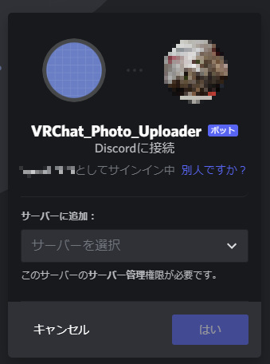

# discordbot_photo_sender
指定ディレクトリを監視し、ファイルが増えたらDiscordに投稿するスクリプト

Ruby2.5.1での動作を確認済み。

## 簡単な使用方法

bundlerをインストール済みであること。

当スクリプトが存在するディレクトリで、必須gemのインストールを行う。

    bundle install
  
付属のsample.envをコピーし、.envファイルを作成する。

    cp sample.env .env

.envファイルを編集し、下記必要事項を記入する。

    DISCORD_TOKEN='[discord bot token：ここにbotトークンを記入]'
    DISCORD_CLIENT_ID='[discord client id：ここにbotのクライアントIDを記入]'
    PHOTO_DIR_PASS='/mnt/E/syuji_picture/VRChat：ここにアップロードするために監視するディレクトリパスを記入'
    DISCORD_CHANNEL_NAME='vrchat_photo：ここにファイルをアップロードする先のDiscordチャンネル名を記載する'

スクリプトを起動し、ファイルの監視を始める。

    bundle exec ruby vrchatphoto.rb

監視を終了する場合には、Ctrl+cを入力する。

## Discord botの登録方法

まずDiscordのページでログインします。

<https://discord.com/>

次に、下記URLにアクセスし、bot開発者用ページにアクセスします。

<https://discord.com/developers/applications>

New Applicationボタンをクリックします。

botに使うアプリケーション名を入力し、Createボタンをクリックします。

すると、アプリケーションが作られて個別ページに移動します。

このページのApplication IDを.envファイルに記載します。

Botタブに移動し、Add botボタンをクリックします。

Yes, do it!ボタンをクリックします。

ボットが生成されます。アイコンの右にあるTOKENのコピーボタンをクリックすることで、ボットのトークンを取得できます。

OAuthタブに移動します。

Scopeのチェックリストからbotにチェックを入れ、BOT PERMISSIONSチェックリストではSend MessageとAttach Filesにチェックを入れて、BOT PERMISSIONSの上にあるURLをコピーし、ブラウザのURL欄にに貼り付けて移動します。

botをDiscordサーバに追加するための画面が出るので、botを置きたいサーバを選択してはいボタンをクリックします。

スクリプトを起動して、動作を確認します。

